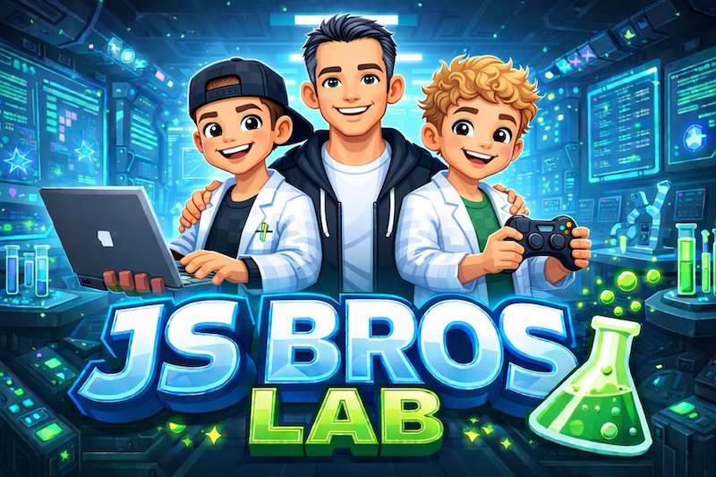

# JS Bros Lab



> A coding curriculum built for kids 9–13, taught by Dad. We learn Git, Markdown, Roblox Studio, and Lua — one lesson at a time.

**Live site:** [js-bro-s.github.io/jsbros-lab](https://js-bro-s.github.io/jsbros-lab/)

---

## What's in Here

| Folder                     | What It Contains                              |
| -------------------------- | --------------------------------------------- |
| `docs/lessons/`            | 11 step-by-step lessons, 45–90 min each       |
| `docs/exercises/`          | 11 exercises, one per lesson, with checklists |
| `docs/github-guide.md`     | The 4 git commands — bookmark this            |
| `docs/progress-tracker.md` | Lesson and exercise completion per student    |

---

## Curriculum Overview

| #   | Lesson                | Key Skills                                    |
| --- | --------------------- | --------------------------------------------- |
| 01  | What We're Building   | Repos, commits, GitHub                        |
| 02  | Writing with Markdown | Headings, lists, code blocks, READMEs         |
| 03  | Git in Action         | `status`, `add`, `commit`, `push`, branches   |
| 04  | Roblox Studio Basics  | Explorer, Properties, Parts, playtesting      |
| 05  | Lua Basics            | Variables, `if/else`, touch events            |
| 06  | Loops                 | `for`, `while`, `task.wait`, spawning parts   |
| 07  | Functions             | Parameters, return values, refactoring        |
| 08  | Tables & Lists        | Lists, `ipairs`, key-value, `pairs`           |
| 09  | Build Your First Game | Coin collector — 4 scripts, full game loop    |
| 10  | GUI & Score Display   | `ScreenGui`, `TextLabel`, `LocalScript`       |
| 11  | Sounds & Effects      | `TweenService`, particles, sound, game polish |

---

## Students

| Name     | GitHub                                               |
| -------- | ---------------------------------------------------- |
| Jonathan | [@jonniedollasjr](https://github.com/jonniedollasjr) |
| Jaxon    | [@jaxondollas](https://github.com/jaxondollas)       |

---

## Getting Started

**View the lessons online:**

```md
https://js-bro-s.github.io/jsbros-lab/
```

**Clone and run locally:**

```bash
git clone https://github.com/js-bro-s/jsbros-lab.git
cd jsbros-lab
npm install
npm start
```

Open [localhost:3000](http://localhost:3000) to preview the site.

---

## Part of the JS Bros Universe

| Repo                                                       | What It Is                           |
| ---------------------------------------------------------- | ------------------------------------ |
| [jsbros-lab](https://github.com/js-bro-s/jsbros-lab)       | This repo — curriculum and docs      |
| [jsbros-games](https://github.com/js-bro-s/jsbros-games)   | Roblox games we build during lessons |
| [jsbros-prints](https://github.com/js-bro-s/jsbros-prints) | 3D printed fidgets and items         |
