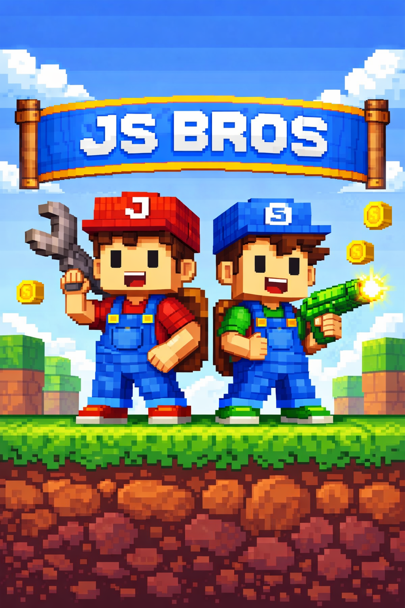

# JS Bros Lab — Lesson 1  




## Getting Started: What We’re Building & How We Work

**Duration:** 60 minutes  
**Audience:** Beginners (kids)  
**Role:** Dad as teacher, kids as students  
**Tone:** Calm, curious, hands-on

---

## 0–5 min — Arrival & Context (Warm-up)

**Goal:** Set expectations and create a safe learning environment.

- Everyone sits at their desks
- Screens on, hands off keyboard
- Explain:
  - This is *lab time*
  - We build slowly and intentionally
  - Mistakes are expected and allowed

**Key phrase:**  
> “Nothing breaks forever in a lab.”

---

## 5–10 min — What Is JS Bros? (Big Picture)

**Goal:** Give meaning before tools.

- Explain the JS Bros universe:
  - **Games**
  - **Lab**
  - **Prints**
  - **Workstation**
- Show the GitHub organization page
- Show the list of repositories

**Kid-friendly framing:**  
> “This is our shared digital notebook.”

---

## 10–20 min — What Is Version Control? (Concept Only)

**Goal:** Understand the idea without touching the keyboard yet.

**Analogies:**

- Game save files
- LEGO instruction books
- Undo button for projects

**Teach only these three ideas:**

1. A **repository (repo)** = project folder
2. A **commit** = save point
3. **GitHub** = cloud backup + teamwork

❌ No commands yet  
✅ Understanding first

---

## 20–30 min — Hands-On: Explore a Repository

**Goal:** Comfort navigating, not editing.

- Open the `jsbros-lab` repository
- Read the `README.md`
- Click through folders and files
- Show file history

**Discussion prompts:**

- “What do you think this file does?”
- “What would happen if we changed this?”

---

## 30–40 min — First Real Action: Local Setup

**Goal:** Create the first small win.

Choose **one**:

- Clone the repository locally  
- OR create a new folder with a README

Example command:

```bash
git clone https://github.com/js-bros/jsbros-lab.git
