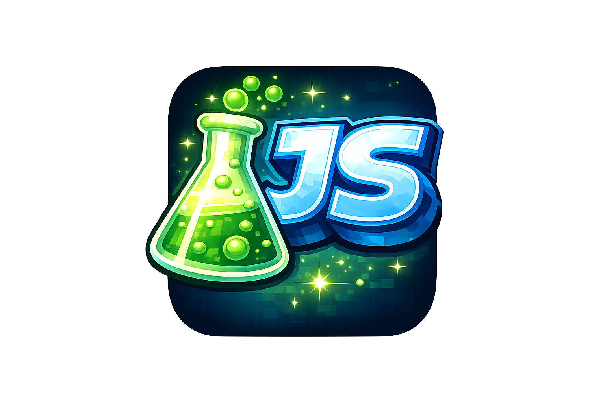

# JS Bros Lab — Lesson 2

## Markdown: Writing That the Computer Can Read

- **Duration:** 45 minutes
- **Prereq:** Lesson 1 complete
- **Goal:** Kids understand what Markdown is, why we use it, and can write a proper README

---

## 0–5 min — What's a README and Why Does It Exist?

Open any GitHub repo and point to the README.

> "Every project has a README. It's the first thing anyone sees. It answers: what is this, how does
> it work, and how do I use it?"

> "We write READMEs in something called Markdown. It's not code — it's a way of writing text that
> looks good everywhere."

---

## 5–15 min — The Problem Markdown Solves

Show plain text vs rendered Markdown side by side.

**Plain text:**

```md
JS Bros Lab This is our coding lab. We learn git, roblox, and lua. Lessons

- lesson 1
- lesson 2 How to start clone the repo and open it
```

**The same thing in Markdown (rendered):**

---

# JS Bros Lab

This is our coding lab. We learn Git, Roblox, and Lua.

## Lessons

- Lesson 1
- Lesson 2

## How to Start

Clone the repo and open it.

---

> "Same words. Totally different experience. Markdown is just symbols that mean 'make this a
> heading' or 'make this a list.'"

---

## 15–30 min — The 8 Things You Actually Need

**1. Headings — `#`**

```md
# Big Heading

## Medium Heading

### Small Heading
```

More `#` = smaller heading. Think of it like an outline.

---

### **2. Bold and Italic**

```md
**this is bold** _this is italic_
```

---

### **3. Lists**

```md
- Item one
- Item two
- Item three

1. First step
2. Second step
3. Third step
```

---

### **4. Code**

Inline code uses backticks:

```md
Use the `print()` function to show output.
```

Code blocks use triple backticks:

````md
```lua
local score = 0
print(score)
```
````

Example:

```lua
local score = 0
print(score)
```

---

### **5. Links**

```md
[Click here](https://github.com/js-bro-s)
```

Example:

[Click this link](https://github.com/js-bro-s)

---

### **6. Images**

```md

```



---

### **7. Horizontal Rule**

```md
---
```

Creates a divider line.

---

### **8. Blockquote**

```md
> "Nothing breaks forever in a lab."
```

---

## 30–42 min — Write Your Own README

Each kid writes a `README.md` for their own mini project folder. It must include:

- `#` heading with the project name
- A short description (2–3 sentences) of what the project is
- A `##` section called **What I Built** with at least 3 bullet points
- A `##` section called **How to Run It** with numbered steps
- One image or link

**Example structure:**

```md
# My Garden Game

A Roblox game where you collect items and drop them in zones. Built for JS Bros Lab Lesson 3.

## What I Built

- A baseplate with colored parts
- An item carry script
- Drop zones that change color on contact

## How to Run It

1. Open `MyGardenGame.rbxl` in Roblox Studio
2. Hit Play
3. Walk around and collect items

## Links

[JS Bros Lab](https://js-bro-s.github.io/jsbros-lab/)
```

---

## 42–45 min — Save & Wrap Up

```bash
git add .
git commit -m "add readme for my project"
git push
```

Open GitHub and show them the rendered README on the repo page.

> "That file you just wrote is now the front page of your project on the internet."

**Ask:**

- "What's the difference between `#` and `##`?"
- "How do you make a code block?"
- "Where else have you seen Markdown used?" (Discord, Reddit, Notion, GitHub)

**Next lesson:** Git in action — saving and sharing your work.

---

:::tip Print Reference [📄 Download the Lesson 02 cheatsheet](/cheatsheets/lesson-02-cheatsheet.pdf)
— print it and keep it on your desk while you work. :::
